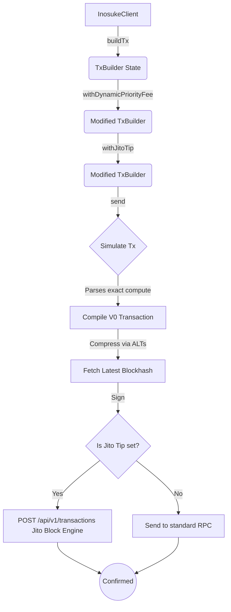

# Inosuke


Inosuke is a modern, lightweight, and professional-grade Solana TypeScript library designed to wrap the `@solana/kit` architecture with an ergonomic, fluent, and intuitive API. 

It bridges the gap between low-level instruction building and high-level developer experience, bringing the full power of Web3.js v2 into a framework that "just works" across all JavaScript environments (Browser, Node.js, Deno, and Bun).

---

## Why Inosuke? (Design Choices & Architecture)

Solana's transition to `@solana/web3.js` v2 (`@solana/kit`) introduced a powerful, functional-first, and highly modular architecture. However, wiring together RPC transformers, instruction pipelines, signers, and blockhash lifetimes manually can result in heavy boilerplate.

Inosuke makes **opinionated design choices** to maximize Developer Experience (DX) without sacrificing performance:

1. **Fluent `TxBuilder` Pattern:** 
   Transactions in Inosuke are built using an immutable builder pattern (`client.buildTx()`). Modifiers like `.withPriorityFee()` or `.withDynamicPriorityFee()` return new instances, preventing state-mutation bugs.
2. **Adaptive Congestion-Aware Priority Fees:** 
   Rather than using flat fee rates, `.withDynamicPriorityFee(level)` queries the **localized fee market** specifically for the read/written accounts in your transaction, sorting and mapping dynamic percentile priorities (`low`, `medium`, `high`, `veryHigh`) with automated safety floors.
3. **Auto-Simulation & Compute Optimization:** 
   By default, Inosuke simulates every transaction locally before sending. It parses the simulation logs to extract the exact compute units consumed, applies a 10% safety buffer, and uses that for the final `ComputeBudget` instruction.
4. **Token-2022 and Legacy Token Native Support:** 
   Associated Token Accounts (ATAs) are notoriously tedious. Inosuke's token handlers (`transferToken`, `mintMore`, `getAta`) automatically resolve ATAs, and support passing a custom `tokenProgram` (supporting both legacy `TOKEN_PROGRAM_ADDRESS` and modern `TOKEN_2022_PROGRAM_ADDRESS` seamlessly).
5. **Dynamic Runtime Anchor Client:**
   Skip complex static code generation scripts! By passing a JSON IDL, `client.loadProgram(programId, idl)` generates an on-the-fly typed Proxy client supporting primitive, structured, and nested Borsh deserialization alongside active 8-byte account discriminator checks.
6. **V0, ALT, and Jito Native:**
   Compiles transactions as Versioned Transactions (`v0`) by default. Address Lookup Tables (ALTs) are supported via `.withAddressLookupTable()`. Appending `.withJitoTip()` routes your transaction through Jito Block Engines for MEV-proof execution.

---

## Architecture Flow



---

# How to Use

Below are the core capabilities and examples of how to use Inosuke.

## 1. Connecting to the Network

Inosuke uses a centralized `InosukeClient` via the `connect()` method to manage your RPC connections.

```typescript
import { connect } from 'inosuke';

// Connect using monikers: "devnet", "testnet", "mainnet", or "localnet"
const client = connect("mainnet");

// Or use a custom RPC URL:
const customClient = connect("https://my-rpc.helius.xyz/api-key");
```

---

## 2. Managing Keypairs

Inosuke makes it easy to generate, load, save, and export Solana keypairs securely. Calling keypair utilities from the browser safely skips file system routines to prevent bundle crashes.

```typescript
import { 
  generateKey, 
  generateExtractableKey, 
  loadKeyFile, 
  saveKeyFile, 
  toBase58 
} from 'inosuke';

// Generate a highly secure, non-extractable key for signing
const signer = await generateKey();

// Load an existing file (e.g., from Solana CLI) - Safe for server-side runtimes
const cliSigner = await loadKeyFile("~/.config/solana/id.json");

// Generate a key that you plan to save/export later
const exportableSigner = await generateExtractableKey();
await saveKeyFile(exportableSigner, "./my-key.json");

// Export to base58 (like Phantom secret keys)
const secretKey = await toBase58(exportableSigner);
```

---

## 3. Account & Network Utilities

You can easily query balances, request airdrops, find PDAs, and calculate rent.

```typescript
import { toSol, toLamport, findPda } from 'inosuke';

// Check SOL Balance
const balanceLamports = await client.balance(signer.address);
console.log("Balance:", toSol(balanceLamports), "SOL");

// Calculate Minimum Rent for an Account (e.g., 165 bytes for a Token Account)
const rent = await client.rentFor(165);

// Find Program Derived Addresses (PDAs) easily
const pda = await findPda(programId, ["my_seed", userAddressBytes]);
```

---

## 4. Fluent Transaction Builder (`TxBuilder`)

Inosuke replaces complex transaction boilerplate with a fluent, immutable `TxBuilder`.

```typescript
import { transferSol } from 'inosuke';

// Generate a transfer instruction
const { instructions } = await transferSol({
  from: signer,
  to: recipientAddress,
  amount: toLamport(1.5),
});

// Build the transaction with localized priority fees
const result = await client
  .buildTx({ feePayer: signer, instructions })
  .withDynamicPriorityFee("high")  // Auto-queries localized account fee market (25th, 50th, 75th, or 95th percentiles)
  .send();                         // Submits and confirms!

console.log("Transaction Confirmed! Signature:", result.signature);
```

### Advanced Routing: Jito & ALTs

Inosuke natively supports **Versioned Transactions (v0)** and offers advanced routing.

```typescript
import { address } from 'inosuke';

// Compress your payload using Address Lookup Tables
const jupiterAlt = address("JUP6LkbZbjS1jKKwapdHNy74zcZ3tLUZoi5QNyVTaV4");

await client.buildTx({ feePayer: signer, instructions: hugeDeFiSwap })
  .withAddressLookupTable(jupiterAlt) // Resolves & compresses accounts behind the scenes
  .withJitoTip(10_000n)               // Routes directly to Jito Block Engine for MEV protection!
  .send();
```

---

## 5. SPL Tokens & Token-2022 (Minting, Transferring, Queries)

Inosuke provides robust, dynamic wrappers for SPL tokens, completely abstracting away the legacy and modern Associated Token Account (ATA) derivation schemas.

### Querying Token Data (Token-2022 Compatible)
```typescript
import { TOKEN_2022_PROGRAM_ADDRESS } from 'inosuke';

// Get supply and decimals
const mintInfo = await client.getMintInfo(mintAddress);

// Get balances under specific token programs
const balance = await client.getTokenBalanceByOwner(mintAddress, userAddress, TOKEN_2022_PROGRAM_ADDRESS);

// Fetch Metaplex Token Metadata (Name, Symbol, Logo)
const metadata = await client.getTokenMetadata(mintAddress);
```

### Creating & Minting Tokens (Token-2022)
```typescript
import { mintToken, mintMore, TOKEN_2022_PROGRAM_ADDRESS } from 'inosuke';

// Step 1: Create the Mint under Token-2022 program ID
const { instructions: createMintIxs, mint } = await mintToken({
  decimals: 9,
  authority: signer,
  tokenProgram: TOKEN_2022_PROGRAM_ADDRESS,
  rentFor: (size) => client.rentFor(size),
});

await client.buildTx({ feePayer: signer, instructions: createMintIxs }).send();

// Step 2: Mint supply (Inosuke automatically derives the Token-2022 ATA)
const { instructions: mintIxs } = await mintMore({
  mint: mint.address,
  authority: signer,
  recipient: signer.address,
  amount: 1_000_000_000n,
  tokenProgram: TOKEN_2022_PROGRAM_ADDRESS,
});

await client.buildTx({ feePayer: signer, instructions: mintIxs }).send();
```

### Transferring Tokens
```typescript
import { transferToken, TOKEN_2022_PROGRAM_ADDRESS } from 'inosuke';

// Transfer tokens to another wallet. Creates recipient ATA inline if missing!
const { instructions } = await transferToken({
  mint: mintAddress,
  from: signer,           
  to: recipientAddress,   
  amount: 500_000_000n,   
  decimals: 9,
  payer: signer,          
  tokenProgram: TOKEN_2022_PROGRAM_ADDRESS,
});

await client.buildTx({ feePayer: signer, instructions }).send();
```

---

## 6. Dynamic Anchor Program Client

Load Anchor programs and parse/decode raw on-chain account states with zero off-chain static code generation steps.

```typescript
import { connect, loadKeyFile, address } from "inosuke";
import customProgramIdl from "./my_custom_program.json";

async function main() {
  const client = connect("devnet");
  const walletSigner = await loadKeyFile("~/.config/solana/id.json");

  // Load the Program dynamically
  const programId = address("MyProgramID11111111111111111111111111111111");
  const program = client.loadProgram(programId, customProgramIdl);

  // Build a Program Instruction dynamically
  const instruction = await program.instruction.initializeUser({
    args: {
      username: "inosuke_warrior",
      age: 18,
    },
    accounts: {
      userProfile: address("UserProfileAccountAddressHere"),
      authority: walletSigner.address,
      systemProgram: address("11111111111111111111111111111111"),
    },
  });

  // Submit the transaction
  await client
    .buildTx({ feePayer: walletSigner, instructions: [instruction] })
    .withDynamicPriorityFee("high")
    .send();

  // Fetch & Decode Account State (Actively validates 8-byte discriminator)
  const profileAddress = address("UserProfileAccountAddressHere");
  const profileState = await program.account.userProfile.fetch(profileAddress);

  console.log("Decoded Username:", profileState.username); // "inosuke_warrior"
  console.log("Decoded Age:", profileState.age);           // 18
}
```